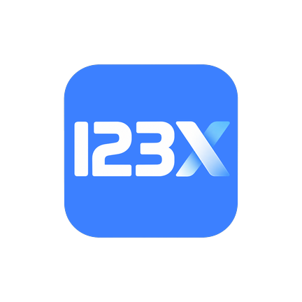

<div align="center">



# [123PanX](https://github.com/bileizhen/123PanX)

为 Android 重新设计的第三方 123 云盘客户端

<p>
  <a href="https://github.com/bileizhen/123PanX/stargazers"></a>
  <a href="https://github.com/bileizhen/123PanX/issues"></a>
  <a href="LICENSE"></a>
  <a href="#兼容性"></a>
  <a href="#功能特性"></a>
</p>

</div>

## 项目简介

123PanX 是一个使用 Kotlin、Jetpack Compose 和 Miuix 开发的原生 Android 云盘客户端。文件浏览、上传下载、预览和分享围绕手机操作重新设计，同时兼顾平板、折叠屏与自由窗口。

界面与下载核心参考 [LeiFetch](https://github.com/bileizhen/LeiFetch)，云盘协议参考 [123pan](https://github.com/123panNextGen/123pan/tree/fluent-dev)。项目仓库位于 [GitHub](https://github.com/bileizhen/123PanX)。

> [!IMPORTANT]
> 123PanX 是独立开发的第三方客户端，与 123 云盘官方没有隶属关系。部分功能依赖服务端接口、账户权限和网络状态，可能随官方服务调整而变化。

## 功能特性

### 账户与云盘信息

- 支持账号 / 手机号与密码登录，以及使用官方 123 云盘 App 扫码登录
- 保存登录状态，管理多个账户，切换账户时隔离文件缓存和任务数据
- 查看 UID、会员状态、空间用量、文件数量、直链流量及登录设备
- 账户信息自动同步，退出登录前二次确认

### 文件浏览与操作

- 目录导航、面包屑、搜索、排序、下拉刷新与列表 / 网格切换
- 优先显示本地缓存，后台同步云端内容；网络失败时保留已有列表
- 长按在手指位置附近打开快捷菜单，多选提供批量操作
- 新建文件夹、重命名、移动、复制、删除和回收站管理
- 删除操作二次确认；下载任务创建后自动进入传输页

### 上传下载

- NSFX 下载核心，支持多连接、Range、断点恢复与暂停 / 继续 / 取消
- 下载连接数可选 1 / 2 / 4 / 8 / 16，不支持 Range 时回退单连接
- 分片上传、秒传、同名冲突处理和上传断点恢复
- 下载与上传分别设置并发任务数和总速度限制
- 统一传输工作台，按进行中、已停止、已完成和全部筛选任务
- 使用 Android 后台调度与传输通知，持久化任务及分段 / 分片进度

### 预览、分享与离线任务

- 图片缩放与平移、视频 / 音频在线播放、PDF 和文本预览
- 创建与管理分享链接，设置分享主题、有效期和提取码
- 前台识别剪贴板中的 123 云盘分享链接，确认后打开官方分享页面
- 离线下载任务和秒传数据导入 / 导出

### 网络、日志与更新

- 不使用代理、系统代理、手动配置和自动探测四种代理模式
- 手动 HTTP / SOCKS5 代理，支持认证和域名 / 内网直连名单
- 从“我的”导出脱敏日志 ZIP，便于反馈问题
- 从“我的 → 检查更新”查询正式发布版本，发现更新后打开发布页

### 界面与语言

- Miuix 分组卡片、悬浮底栏、弹簧动画和预测性返回
- 支持深浅主题、Monet 配色、模糊、液态玻璃与显示缩放
- 宽屏自动使用侧栏，不支持模糊效果的设备回退到纯色界面
- 支持简体中文、English 和跟随系统，可在设置中切换

## 兼容性

| 项目 | 支持情况 |
| --- | --- |
| 最低 Android 版本 | Android 8.0（API 26） |
| 目标 Android 版本 | Android 16（API 36） |
| 布局 | 手机、平板、折叠屏及自由窗口；宽度 ≥ 840dp 使用侧栏 |
| Monet | Android 12（API 31）及以上 |
| 模糊与液态玻璃 | 按系统与渲染能力启用，不支持时使用纯色回退 |
| 文件保存与上传来源 | Android 系统文件选择器 / SAF |

## 安装

目前项目处于开发中，[Releases](https://github.com/bileizhen/123PanX/releases) 尚未提供正式安装包。可使用本地源码按下文构建；正式发布后从 Releases 获取 APK。

1. 安装构建生成的 APK，打开 123PanX。
2. 使用账号 / 手机号和密码登录，或使用官方 123 云盘 App 扫描登录二维码。
3. 在“我的 → 设置”选择下载位置，并按需要配置传输与外观。
4. 从文件页上传或下载文件，在传输页查看进度。

> [!NOTE]
> 使用系统文件选择器指定下载目录时，需要授予该目录的访问权限。Debug 包名带 `.debug` 后缀，与正式包的数据独立。

## 常见问题

### 下载的文件保存在哪里？

在“我的 → 设置 → 保存位置”查看或更改下载目录。开启“每次询问下载位置”后，每批下载先选择目录；已经创建的任务继续使用原来的保存位置。

### 为什么切换列表 / 网格后没有重新加载？

切换只改变展示方式，会保留当前浏览位置。需要同步云端变化时，下拉刷新或使用文件页的刷新入口；网络失败时仍可查看已有缓存。

### 切到后台后传输暂停怎么办？

先检查传输页的任务状态和错误提示，再确认网络、目录权限与系统后台限制。进程被终止后，未完成任务会保留检查点，重新打开应用后可手动继续。

### 代理怎么设置？

进入“我的 → 设置 → 代理”，选择模式后点击“保存”。手动模式支持 HTTP / SOCKS5、服务器、端口与可选认证；直连名单优先于代理设置。自动模式先使用系统代理，再探测本机常见代理端口，未发现可用代理时直连。

### 如何检查更新？

点击“我的 → 检查更新”，该入口位于“关于”上方。发现新版本后可打开发布页查看并下载安装；没有可访问的正式版本时会显示相应提示。

### 界面语言怎么切换？

在“我的 → 设置 → 界面语言”选择简体中文、English 或跟随系统。切换语言不改变账户、文件名、目录名和传输任务。

### 如何反馈问题？

在 [Issues](https://github.com/bileizhen/123PanX/issues) 描述操作步骤、预期结果、实际现象、应用版本和 Android 版本。需要日志时，从“我的 → 导出日志”生成 ZIP；分享截图前请遮挡个人信息。

## 隐私

- 云盘登录、文件操作、传输和在线预览会请求相应服务；版本检查使用 GitHub，自动代理模式会进行代理协议探测。
- 账户 Token 和代理认证信息通过 Android Keystore / AES-GCM 加密保存，不以明文写入数据库或普通设置。
- 剪贴板识别在设备本地完成，可在设置中关闭；打开识别出的分享链接需要用户确认。
- 日志统一脱敏，不记录密码、Token、Cookie、完整签名链接或 URL 查询参数。
- 导出的诊断 ZIP 包含应用 / 设备版本、任务状态计数与脱敏日志，不包含账户凭据、云文件内容或数据库导出。

## 从源码构建

需要 JDK 21、Android SDK 37 和 Build Tools 37.0.0。Java / Kotlin 编译目标为 17。创建本地 `local.properties`，填写 Android SDK 路径：

```properties
sdk.dir=C\:/Users/your-name/AppData/Local/Android/Sdk
```

Windows 构建与检查：

```powershell
.\gradlew.bat :app:assembleDebug :app:testDebugUnitTest :app:lintDebug
```

Linux / macOS：

```bash
chmod +x gradlew
./gradlew :app:assembleDebug :app:testDebugUnitTest :app:lintDebug
```

设备测试需要连接 Android 设备或启动模拟器：

```powershell
.\gradlew.bat :app:connectedDebugAndroidTest
```

Debug APK 位于 `app/build/outputs/apk/debug/app-debug.apk`。正式发布需要配置自己的签名密钥。

> [!NOTE]
> Windows 出现 `Unable to establish loopback connection` 时，确认 Gradle 使用 JDK 21，并将 `TEMP`、`TMP` 与 `jdk.net.unixdomain.tmpdir` 指向已存在的纯英文临时目录。多个设备连接时，可通过 `ANDROID_SERIAL` 指定测试设备。

## 参与开发

- [第三方依赖与许可证](THIRD_PARTY_NOTICES.md)

## 开源协议

123PanX 按 [GPL-3.0](LICENSE) 分发。界面、通用组件与 NSFX 下载核心参考或迁移自 LeiFetch，日志导出参考 XBlocker，云盘协议参考 123pan。各上游的版权、许可和来源说明见 [THIRD_PARTY_NOTICES.md](THIRD_PARTY_NOTICES.md)。

## 致谢

- [LeiFetch](https://github.com/bileizhen/LeiFetch)：Android 界面、导航、通用动画与 NSFX 下载核心
- [123pan](https://github.com/123panNextGen/123pan/tree/fluent-dev)：123 云盘协议与业务行为参考
- [XBlocker](https://github.com/bileizhen/XBlocker)：日志导出及 README 组织方式参考
- [Miuix](https://github.com/compose-miuix-ui/miuix)：Compose 界面组件
- [SukiSU-Ultra](https://github.com/SukiSU-Ultra/SukiSU-Ultra)：部分界面组件的上游来源

## 浏览量

<div align="center">


</div>
